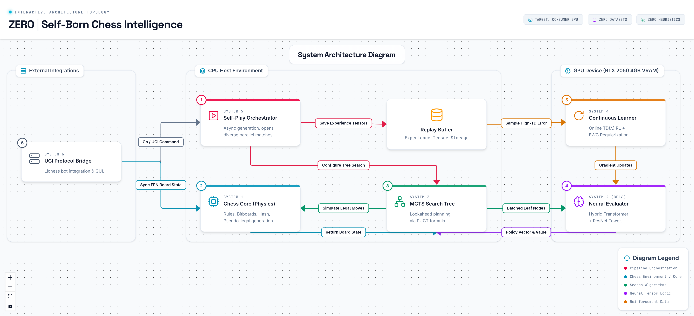

# ZERO: Self-Born Chess Reinforcement Learning Engine

> **A self-born chess engine that learns entirely from tabula rasa self-play.** ZERO implements the full rules of chess, searches using parallel batch MCTS guided by a hybrid Transformer-ResNet policy/value network, trains continuously, speaks UCI, and uses zero human games, opening books, handcrafted evaluations, or tablebases.

---

## System Architecture



ZERO's architecture is a highly optimized, dual-process pipeline designed to maximize both **GPU neural inference throughput** and **multiprocess CPU self-play generation** on consumer-grade hardware. The system orchestrates persistent worker processes (self-play, GPU evaluator, trainer, utilization monitor) communicating over multiprocess queues.

---

## Key Highlights & Core Principles

- **No Human Knowledge**: No handcrafted evaluation heuristics, opening books, or endgame tablebases. ZERO starts with zero knowledge of chess strategy beyond the basic movement rules.
- **Asymmetric Payoffs (Hunter Mode)**: Features aggressive reinforcement learning targets that penalize early resignation and stale draws to cultivate a highly active, attacking playstyle.
- **Hybrid Transformer-ResNet Policy/Value Network**: Combines deep convolutional residual towers (for local board spatial patterns) with Board Transformer Blocks (for global piece coordination).
- **Parallel Asynchronous Self-Play**: A persistent multi-process runtime where worker processes play chess games on CPU and stream evaluation queries to a single batching GPU worker.
- **Memory Guardrails**: Intelligently scales prioritized replay buffer capacity and monitors system RAM to auto-suspend training and release CUDA/RAM cache when resource thresholds are breached.

---

## Project Structure

```
ZERO/
├── zero_chess/                    # Core engine package
│   ├── board.py                   # Full chess rules engine (legal moves, FEN, SAN)
│   ├── move.py                    # Compact immutable move representation with UCI
│   ├── zobrist.py                 # Deterministic 64-bit Zobrist hashing tables
│   ├── constants.py               # Core constants, square/color utilities
│   ├── model.py                   # Hybrid Transformer-ResNet policy/value network
│   ├── encoding.py                # Neural tensor encoding (119 planes, policy indexing)
│   ├── mcts.py                    # Non-zero-sum parallel batch PUCT MCTS
│   ├── training.py                # Continuous training loop, loss functions, TD-lambda
│   ├── self_play.py               # Parallel & persistent multiprocess self-play generator
│   ├── replay.py                  # Prioritized replay buffer (hot RAM + cold SQLite)
│   ├── ema.py                     # Exponential Moving Average teacher network
│   ├── ewc.py                     # Elastic Weight Consolidation for continual learning
│   ├── checkpoint.py              # Thread-safe checkpoint management with self-healing
│   ├── checkpointing.py           # Compatibility wrapper for checkpoint module
│   ├── targets.py                 # Asymmetric RL payoff anchors & opponent value transform
│   ├── elo.py                     # Running Elo rating with custom draw/win penalties
│   ├── arena.py                   # Head-to-head checkpoint evaluation with GPU GC
│   ├── pgn.py                     # PGN format exporter for self-play games
│   ├── uci.py                     # Universal Chess Interface protocol engine
│   ├── websocket_server.py        # FastAPI WebSocket bridge with self-healing subprocess
│   ├── lichess.py                 # Lichess bot deployment config generator
│   └── __init__.py                # Package exports (Board, Move, ZERONetwork)
├── train.py                       # Main training orchestrator (CLI entry point)
├── tests/                         # Comprehensive test suite
│   ├── test_board.py              # Full rules engine correctness (movegen, FEN, draws)
│   ├── test_encoding.py           # Neural encoding plane verification
│   ├── test_mcts.py               # MCTS search & tree reuse correctness
│   ├── test_elo.py                # Elo rating update logic
│   ├── test_replay.py             # Prioritized replay buffer (hot+cold storage)
│   ├── test_self_play.py          # Self-play game generation pipeline
│   ├── test_hunter_rewards.py     # Asymmetric payoff matrix validation
│   ├── test_encoding_mcts_uci.py  # Integration: encoding <-> MCTS <-> UCI
│   ├── test_audit_fixes.py        # Regression tests for past fixes
│   ├── test_model_optional.py     # Optional: model forward pass shapes
│   ├── test_training_optional.py  # Optional: training step (needs model)
│   └── test_performance.py        # Optional: movegen throughput benchmarks
├── frontend/                      # Next.js React web GUI
│   ├── app/                       # App router (play/, watch/, history/)
│   ├── components/                # ChessBoard, EvaluationBar, Clock, MoveHistory, etc.
│   └── lib/                       # Chess logic, engine WebSocket client, audio
├── configs/
│   └── lichess-bot.yml.example    # Lichess deployment configuration template
├── scripts/
│   ├── install.sh                 # One-shot setup: install + verify + test
│   ├── train_loop.sh              # Auto-restart wrapper for crash recovery
│   └── perft.py                   # Performance test (perft) for move generation
├── checkpoints/                   # Saved model checkpoints (auto-managed)
├── data/                          # Replay buffers, PGN logs, training JSONL
├── logs/                          # Training logs, arena logs, utilization logs
├── pyproject.toml                 # Build config, CLI scripts, pytest config
├── requirements.txt               # Python dependencies
└── LICENSE                        # MIT License
```

---

## Detailed Module Breakdown

### 1. Chess Core Rules Engine (`board.py`, `move.py`, `zobrist.py`, `constants.py`)
- **Move Generation**: Custom rules engine with pseudo-legal and legal move generation for pawns, sliders, knights, castling, en passant, and promotions.
- **Incremental State Updates**: Optimized push/pop mechanics with an internal history stack preserving full state snapshots.
- **Zobrist Hashing**: Collision-resistant 64-bit zobrist hash keys seeded deterministically (`0x5EED_5E1F_BADC_0DE`), tracking en passant files, castling rights, active turns, and threefold repetitions.
- **Draw Detection**: Automatic verification of the 50-move rule, threefold repetition, and insufficient material (KvK, KBvK, KNvK, KBvKB same color).
- **Move Representation**: Immutable, slot-optimized `Move` dataclass with bit-packed 32-bit encode/decode, UCI string conversion, and flag-based type checking (capture, promotion, en passant, castling).
- **SAN Generation**: Standard Algebraic Notation with disambiguation for same-target moves.
- **Perft Utility**: `scripts/perft.py` for move generation correctness verification against known positions.

### 2. Neural Network Architecture (`model.py`, `encoding.py`)
- **Input Feature Planes**: Encodes the board state into **119 planes** — 8 historical positions × 14 piece planes + 6 auxiliary planes (turn, castling ×4, en passant file, move clock).
- **Residual Blocks**: 20 convolutional residual blocks with Squeeze-and-Excitation channels for dynamic channel-wise feature recalibration.
- **Global Attention**: `BoardTransformerBlock` inserted every 3 blocks — 8-head multi-head self-attention over 64 spatial positions with learned positional encoding and GELU feed-forward.
- **Multi-Headed Outputs**:
  - **Policy Head**: Outputs masked logits representing 4,672 policy coordinates (73 planes × 64 squares).
  - **Value Head**: Scaled tanh activation mapping to $[-31.0, 1.0]$ domain.
  - **WDL Head**: 3-way softmax predicting Win/Draw/Loss probabilities.
  - **Uncertainty Head**: Softplus-activated uncertainty estimation for MCTS.
  - **Auxiliary Heads**: Material balance, piece mobility, and king safety for accelerated early feature learning.
- **Mixed Precision**: Full bf16/fp16 autocast support with gradient scaling.
- **Architecture**: 384 channels, 20 blocks, 8 attention heads, 64 policy channels (~120M parameters).

### 3. Asymmetric Monte Carlo Tree Search (`mcts.py`)
- **PUCT Formula**: Guides search selection using node prior probabilities, visit counts, and virtual losses with configurable $c_{\text{PUCT}}$.
- **Dirichlet Noise**: Injects noise ($\alpha=0.3$, $\epsilon=0.25$) at the root node during self-play to guarantee opening diversity.
- **Subtree & Transposition Reuse**: Preserves visited child nodes across consecutive moves for zero-latency incremental searches.
- **Parallel Batch Evaluation**: `SharedBatchEvaluator` coalesces concurrent evaluation requests from multiple MCTS threads into large GPU batches within a configurable time window.
- **Virtual Loss**: Enables parallel MCTS simulations on a single tree without over-visitation.
- **Iterative Node Clearing**: Stack-based tree reset that eliminates recursion limits under deep search trees (512+ plies).
- **Time-Managed Search**: `search_time()` supports UCI `movetime` control with deadline-driven simulation loops.
- **Adaptive Resign Detection**: Configurable resign threshold with streak-based confirmation (10 consecutive below-threshold evaluations).

### 4. Prioritized Replay Buffer (`replay.py`)
- **Prioritized Experience Replay (PER)**: Uses a binary SumTree for $O(\log N)$ priority updates and $O(\log N)$ weighted sampling.
- **Multi-Tier Storage**:
  - **Hot Tier**: Fast in-memory ring buffer (default 20K) holding the latest high-priority experiences.
  - **Cold Tier**: Persistent SQLite3 database with Write-Ahead Logging (WAL) and optimized random-ID probing for $O(k \log n)$ sampling from millions of historical positions.
- **Hardware Autotuning**: Automatically reduces hot capacity to 10K on systems with <2GB available RAM to prevent OOM.
- **Importance Sampling**: Beta annealing from 0.4 → 1.0 over 500K steps with IS weight normalization.
- **Thread Safety**: Full `threading.RLock` synchronization on all mutating operations.
- **Persistence**: Atomic pickle save/load for hot buffer; SQLite for cold tier with overflow eviction.

### 5. Continuous Learning & Optimization (`training.py`, `ema.py`, `ewc.py`)
- **TrainConfig**: Batch size 2048, AdamW (fused) with weight decay, gradient clipping at 1.0.
- **Continuous LR Scheduler**: Cosine annealing decay from `2e-3` to `1e-4` over 500 iterations.
- **TD-λ Blended Targets**: Lambda-weighted combination of terminal outcome and 5-ply bootstrapped values.
- **Auxiliary Losses**: Material balance MSE, mobility count MSE, and king safety binary loss — weighted at 0.3.
- **EWC (Elastic Weight Consolidation)**: Computes Fisher Information Matrix over a 500-sample replay subset, applying quadratic penalty ($\lambda=0.1$) on weight drift.
- **EMA Teacher**: `EMATeacher` with $\text{decay}=0.999$, periodic promotion when student scores >60% in arena matches.
- **Loss Sanity Checks**: Skips optimizer step on NaN/Inf or loss >2000 to prevent weight corruption.

### 6. Self-Play Engine (`self_play.py`)
- **Play Game Pipeline**: Full game generation with MCTS, temperature scheduling (1.0 → 0.0 at move 30), opening randomization (8 random plies at 50%), and early adjudication (20-ply rolling average).
- **Asymmetric Rewards**: Custom terminal payoff matrices (checkmate: +1.0/-3.0, resignation: 0.0/-30.0, stalemate: -10.0/-10.0) with aggression/momentum/panic bonuses.
- **Parallel Generation**: Thread-based `generate_parallel_games()` for CPU mode; multiprocess `generate_multiprocess_games()` with FEN-based IPC for GPU mode.
- **Persistent Runtime**: `start_persistent_cuda_training()` launches 4 coordinated process types:
  - **Self-play workers** (CPU): Play games, stream FENs to evaluator queue.
  - **GPU evaluator** (CUDA): Coalesces FEN batches, runs model inference with `torch.compile` support.
  - **Trainer** (CUDA): Consumes game results, runs gradient updates, manages EMA/EWC.
  - **Utilization monitor**: Logs GPU utilization, VRAM, RAM, game throughput every 30s.
- **Memory Guard**: Pauses generation when available RAM < 512MB, triggers GC and CUDA cache clearing.
- **Game History Logging**: Auto-appends to PGN and JSONL files in `data/`.

### 7. Training Orchestrator (`train.py`)
- **Bootstrap Mode**: Pure CPU self-play with `UniformEvaluator` when PyTorch is unavailable.
- **CUDA Mode**: Fresh weight initialization or resume from checkpoint.
- **Periodic Arena**: Every 20 iterations — student vs. EMA teacher (40 games, 800 simulations) with Elo tracking and teacher promotion on >60% score.
- **EWC Consolidation**: Every 50 iterations over replay buffer.
- **Checkpointing**: Every iteration with `CheckpointManager` — keeps last 20 + every 50th permanently.
- **Signal Handling**: Graceful shutdown on SIGTERM/SIGINT with emergency checkpoint save.
- **Configuration**: 30+ CLI flags for simulations, batch sizes, network architecture, temperature, opening book randomization, and memory limits.

### 8. Arena Evaluation (`arena.py`)
- Head-to-head match between any two evaluators (network checkpoints or uniform).
- Balanced color assignment (half games as White).
- Configurable games, simulations, max plies with Elo tracking.
- Per-game MCTS tree cleanup with GPU cache clearing for memory safety on 8GB systems.

### 9. Interfaces & Deployment

#### UCI Protocol (`uci.py`)
- Full UCI implementation: `uci`, `isready`, `setoption`, `ucinewgame`, `position`, `go`, `stop`, `quit`.
- Fast incremental tree reuse via `advance_to()` on sequential position commands.
- Time management with adaptive budgeting (40-move target + increment + opponent-aware scaling).
- Configurable options: `Simulations`, `CPuct`, `Checkpoint`, `Device`.

#### WebSocket Bridge (`websocket_server.py`)
- FastAPI server with CORS and async UCI subprocess management.
- Self-healing subprocess: auto-restarts on crash, lock-guarded transactions.
- Endpoints: `GET /history` (training game records), `WS /ws` (FEN → bestmove).
- Optimized binary tail reader for JSONL logs (prevents RAM exhaustion).

#### Frontend (`frontend/`)
- Next.js 14 React GUI with Tailwind CSS.
- Components: Interactive `ChessBoard`, `EvaluationBar`, `Clock`, `MoveHistory`, `CapturedPieces`, `PromotionDialog`, `GameEndModal`, `StatusBanner`.
- Pages: Play vs ZERO (`/play`), Watch self-play (`/watch`), Training history (`/history`).
- Engine client: WebSocket bridge to `zero_chess.websocket_server`.

#### Lichess Bot (`lichess.py`, `configs/lichess-bot.yml.example`)
- Config generator for the `lichess-bot` bridge.
- Supports bullet/blitz/rapid/classical time controls, casual and rated modes.
- Matchmaking with configurable rating range and challenge intervals.

### 10. Checkpoint Management (`checkpoint.py`, `checkpointing.py`)
- Atomic saves using tmp-replace pattern to prevent corruption.
- Thread-safe index with JSON metadata (iteration, Elo, timestamp, metrics).
- Self-healing: auto-reconstructs index from filesystem if `index.json` is corrupted.
- Automatic pruning: keeps last N checkpoints + every Mth permanent checkpoint.

---

## Installation & Setup

### Hardware Requirements
- **VRAM**: NVIDIA GPU with at least **4GB VRAM** for inference; **20GB+ VRAM** recommended for high-throughput training (tested target: RTX PRO 4000 Blackwell, 24GB VRAM, 128GB RAM, 24-core CPU).
- **RAM**: Minimum **8GB System RAM** recommended (the replay engine automatically scales to fit tight systems).
- **CPU**: CPU mode is fully supported for testing, but active reinforcement training requires a CUDA-enabled GPU.

### Commands
```bash
# 1. Clone the repository and navigate to root
cd ZERO

# 2. Install dependencies
python -m pip install -r requirements.txt

# 3. Install in developer mode
python -m pip install -e ".[dev]"

# 4. Verify PyTorch and CUDA availability
python -c "import torch, zero_chess; print('CUDA Ready:', torch.cuda.is_available())"

# Or use the one-shot install script
bash scripts/install.sh
```

Dependencies: `numpy`, `torch>=2.2.0`, `psutil`, `fastapi`, `uvicorn`, `websockets`, `pytest`.

---

## Execution & Training Guide

### 1. Execute Unit Tests
Ensure the entire engine is fully functional by running the test suite (13 test files):
```bash
python -m pytest
```

### 2. Verify Move Generation
```bash
python scripts/perft.py --depth 3
```

### 3. Start Self-Play Training Loop
Run the primary training coordinator:
```bash
python train.py
```
- **Bootstrap Phase**: When no PyTorch is found, falls back to CPU self-play using `UniformEvaluator`.
- **CUDA Multi-Process Phase**: Spawns CPU worker processes that play games and stream FENs to a GPU evaluator process. The evaluator coalesces positions into large GPU batches for maximum throughput.

### 4. Resume Training
```bash
python train.py --resume checkpoints/latest.pt
```

### 5. Tuning for High-VRAM GPUs (20GB+)
The defaults target a 24GB Blackwell GPU with 128GB RAM:
```bash
python train.py \
  --persistent \
  --games_per_iteration 24 \
  --self_play_simulations 400 \
  --mcts_batch_size 64 \
  --gpu_batch_size 256 \
  --training_batch_size 2048 \
  --updates_per_game 30 \
  --cuda_memory_fraction 0.92
```
- `--persistent`: keeps workers alive across iterations instead of spawning per iteration.
- `--training_batch_size 2048`: doubles default; fits ~13GB VRAM with bf16 mixed precision.
- `--gpu_batch_size 256`: larger evaluation batches improve GPU utilization.
- `--games_per_iteration 24`: more parallel CPU workers (24-core CPU supports this).
- `--compile_model` (persistent mode only): enables `torch.compile` for the evaluator.

For auto-restart on crashes:
```bash
bash scripts/train_loop.sh
```

### 6. CLI Entry Points
```bash
# UCI engine
python -m zero_chess.uci --checkpoint checkpoints/latest.pt

# Self-play game generation
python -m zero_chess.self_play --checkpoint checkpoints/latest.pt --games 10

# One training step from replay buffer
python -m zero_chess.training --replay data/replay.pkl --checkpoint checkpoints/latest.pt

# Arena evaluation between checkpoints
python -m zero_chess.arena --a checkpoints/student.pt --b checkpoints/teacher.pt

# WebSocket server
python -m zero_chess.websocket_server --checkpoint checkpoints/latest.pt
```

---

## Playing & Interface Integrations

### WebSocket Web GUI
ZERO comes with a Next.js React frontend:
```bash
# 1. Launch the FastAPI WebSocket Server
python -m zero_chess.websocket_server --checkpoint checkpoints/latest.pt --device cuda

# 2. Build and launch the React Frontend
cd frontend
npm install
npm run dev
```

### UCI Play
Speaks the standard Universal Chess Interface protocol. Connect to any chess GUI (Arena, ChessBase, cutechess):
```bash
python -m zero_chess.uci --checkpoint checkpoints/latest.pt --device cuda
```

### Lichess Bot Deployment
```bash
# 1. Copy the example configuration template
cp configs/lichess-bot.yml.example lichess-bot.yml

# 2. Edit lichess-bot.yml with your Lichess API Token
# 3. Run the Lichess Bot Bridge
lichess-bot --config lichess-bot.yml
```

---

## Algorithmic Payoff Matrices

ZERO enforces aggressive, non-zero-sum reinforcement learning payoffs:

| Outcome | My Payoff | Opponent Payoff | Strategic Rationale |
| :--- | :---: | :---: | :--- |
| **Checkmate Win** | `+1.0` | `-3.0` | Encourages hunting for absolute checkmate finishes. |
| **Checkmate Loss** | `-3.0` | `+1.0` | Severely penalizes getting checkmated. |
| **Resignation Win** | `0.0` | `-30.0` | Standard win value. |
| **Resignation Loss** | `-30.0` | `0.0` | Imposes catastrophic penalties on resigning early. |
| **Standard Draw** | `-1.0` | `-1.0` | Penalizes drawish peace offers. |
| **Stalemate Draw** | `-10.0` | `-10.0` | Discourages tactical stales. |
| **Max Plies Draw** | `-20.0` | `-20.0` | Severe penalty on long, repetitive endgames. |

### Symmetric Opponent Value Transform
Backpropagates non-zero-sum payoffs through MCTS paths via piecewise linear interpolation:
```python
x0 <= val <= x1  =>  y0 + (val - x0) * (y1 - y0) / (x1 - x0)
```
Anchor points: `(-30, 0)`, `(-20, -20)`, `(-10, -10)`, `(-3, 1)`, `(-1, -1)`, `(0, -30)`, `(1, -3)`.

---

## License

This project is licensed under the **MIT License**. See `LICENSE` for details.
